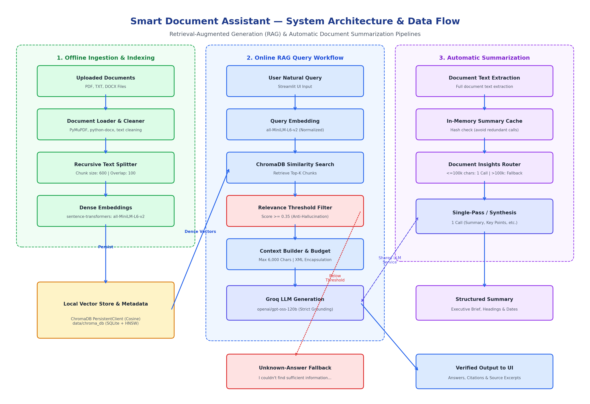

# Smart Document Assistant — GenAI Take-Home Project

[](https://www.python.org/)
[](https://streamlit.io/)
[](https://www.trychroma.com/)
[](https://groq.com/)
[](pytest.ini)

An enterprise-ready, grounded Document Assistant built with **Retrieval-Augmented Generation (RAG)** in Python and Streamlit. Enables users to upload multiple PDF, TXT, and DOCX documents, ask natural language questions, receive factually grounded answers with verified citations, and automatically generate structured executive document summaries.

---

## Table of Contents
1. [Project Overview](#1-project-overview)
2. [Problem Statement](#2-problem-statement)
3. [Key Features](#3-key-features)
4. [Technology Stack & Rationale](#4-technology-stack--rationale)
5. [RAG Explained in Context](#5-rag-explained-in-the-context-of-this-project)
6. [System Architecture & Data Flow](#6-system-architecture--data-flow)
7. [Detailed Pipeline Explanation](#7-detailed-pipeline-explanation)
8. [Hallucination Prevention & Reliability Safeguards](#8-how-hallucination-risks-are-reduced)
9. [Project Directory Structure](#9-project-directory-structure)
10. [Prerequisites](#10-prerequisites)
11. [Windows Environment Setup & Installation](#11-windows-environment-setup--installation)
12. [Configuring the Groq API Key](#12-configuring-the-groq-api-key)
13. [Launching the Application](#13-how-to-launch-the-streamlit-application)
14. [Local Vector Storage & Persistence](#14-how-local-vector-storage--persistence-work)
15. [Running Automated Tests](#15-how-to-run-tests)
16. [Known Limitations & Future Improvements](#16-known-limitations--future-improvements)
17. [AI Tools Used During Development](#17-ai-tools-used-during-development)
18. [Security & Secrets Policy](#18-security-considerations)
19. [Example Questions & Expected Behaviors](#19-example-demo-questions--expected-behavior)

---

## 1. Project Overview

The **Smart Document Assistant** is a desktop/web GenAI solution designed to solve private knowledge management challenges. Built with a modular architecture, it transforms unstructured corporate documents into a searchable semantic vector space, enabling users to:
* Search across diverse file formats (`.pdf`, `.txt`, `.docx`) simultaneously.
* Receive natural answers directly backed by retrieved excerpts and page numbers.
* Prevent hallucinations by enforcing deterministic fallback responses when evidence is missing.
* Generate section-by-section executive summaries for long reports.

---

## 2. Problem Statement

Standard Large Language Models (LLMs) present two critical challenges when deployed for private organizational data:
1. **Knowledge Cutoff & Privacy**: General LLMs have no access to confidential internal documents, policies, and contracts.
2. **Hallucination & Lack of Verification**: When asked about specific internal facts, models often invent convincing but completely fabricated answers and bogus citations.

The Smart Document Assistant addresses this by pairing a fast local dense embedding model (`sentence-transformers/all-MiniLM-L6-v2`) and vector search (`ChromaDB`) with Groq's high-performance LLM inference engine (`openai/gpt-oss-120b`), enforcing strict grounding and verbatim source attribution.

---

## 3. Key Features

* **Multi-Format Ingestion**: Supports `.pdf` (page-by-page via PyMuPDF with pypdf fallback), `.txt` (UTF-8, Latin-1 encodings), and `.docx` (paragraphs and tables via python-docx).
* **Deterministic Anti-Hallucination Guardrails**: Cosine similarity thresholding (`>= 0.35`) and strict prompting reject unsupported questions with an explicit, standardized unknown message:
  > *"I couldn't find sufficient information to answer this question in the uploaded documents."*
* **Verifiable Source Attribution**: Every response provides expandable source cards displaying the exact filename, page number (or N/A indicator for plain text), cosine similarity score, and verbatim excerpt.
* **Persistent Local Vector Database**: Built on ChromaDB `PersistentClient` with persistent SQLite/HNSW indexing, eliminating re-embedding on app restarts.
* **Automatic Document Summarization**: Independent creative feature offering single-pass structured insights (Summary, Key Points, Important Numbers, Action Items) for small and medium documents up to 100,000 characters (~25–30 pages) in a single API call, with graceful section-based fallback and immediate rate-limit abortion for exceptionally large documents. Includes SHA-256 caching to avoid redundant API costs.
* **Interactive UI**: Built with Streamlit, providing multi-document upload, sample data loading with 1 click, document deletion, conversation history, and an internal chunk inspector.

---

## 4. Technology Stack & Rationale

| Layer | Technology | Version | Rationale |
| :--- | :--- | :--- | :--- |
| **Language** | Python | 3.10 – 3.13 | High ecosystem compatibility and rich ML support. |
| **Frontend** | Streamlit | 1.35+ | Rapid, clean UI development with native session state and streaming support. |
| **PDF Extraction** | PyMuPDF (`fitz`) | 1.24+ | Up to 10x faster than legacy parsers; accurately extracts page-level text blocks. |
| **DOCX Extraction**| `python-docx` | 1.1+ | Robust extraction of paragraphs and table data without requiring Microsoft Office. |
| **Embeddings** | `sentence-transformers` | 2.7+ (`all-MiniLM-L6-v2`) | Lightweight (80MB), fast local CPU inference, 384-dim normalized dense vectors; zero external API latency or cost. |
| **Vector Store** | `chromadb` | 0.5+ | Local persistent vector database with HNSW cosine search and unified vector/metadata storage. |
| **LLM** | Groq (`groq` SDK) | 0.11+ (`openai/gpt-oss-120b`) | Ultra-fast inference on LPU architecture, reliable grounded reasoning, accessible API. |
| **Config** | `python-dotenv` | 1.0+ | Standard, secure 12-factor application configuration management. |
| **Testing** | `pytest` | 8.0+ | Automated unit and integration testing with mocked LLM clients. |

---

## 5. RAG Explained in the Context of This Project

**Retrieval-Augmented Generation (RAG)** is an architectural pattern that bridges static LLMs with dynamic external knowledge bases.

In this project, RAG functions as follows:
1. **Indexing (Offline)**: User documents are chopped into overlapping chunks, transformed into 384-dimensional semantic vectors, and indexed in ChromaDB.
2. **Retrieval (Online)**: When a user asks a question, the query is embedded into the same 384-dimensional vector space. ChromaDB identifies chunks whose semantic vector directions align closest with the question.
3. **Augmentation**: The top-matching chunks are inserted into an XML-fenced context block (`<document_context>`), paired with strict grounding instructions.
4. **Generation**: Groq reads *only* the retrieved context block to generate the factual response.

---

## 6. System Architecture & Data Flow



The system cleanly separates three distinct workflows:
1. **Offline Ingestion & Indexing Pipeline**:
   `Document Upload` → `Text Extraction` → `Text Cleaning` → `Recursive Text Splitter` → `SentenceTransformer Embeddings` → `ChromaDB Persistent Collection`.
2. **Online RAG Query Pipeline**:
   `User Query` → `Query Embedding` → `ChromaDB Cosine Search` → `Relevance Filter (>= 0.35)` → `Context Bounding (Max 6,000 chars)` → `Anti-Injection Prompt` → `Groq (openai/gpt-oss-120b)` → `Grounded Answer + Source Citations`.
3. **Automatic Document Summarization Pipeline**:
   `Selected Document` → `SHA-256 Cache Check` → `Length Router (<= 100k vs > 100k chars)` → `Single Pass LLM Call OR Section Map-Reduce with 429 Early-Exit` → `Structured Document Insights (Summary, Key Points, Numbers, Action Items)`.

*An editable Mermaid diagram is available in [`docs/architecture.md`](docs/architecture.md).*

---

## 7. Detailed Pipeline Explanation

### Ingestion & Cleaning
Raw documents are parsed page-by-page. The cleaning step strips null bytes (`\x00`), normalizes line endings (`\r\n` to `\n`), collapses multi-space tabs, and preserves paragraph breaks.

### Recursive Text Splitting
Unlike naive fixed-size splitters that slice words in half, our `RecursiveTextSplitter` respects language syntax:
* Tries splitting by paragraphs (`\n\n`), lines (`\n`), sentences (`. `, `? `, `! `), words (` `), and fallback characters.
* Configurable chunk size (default: 600 characters) and overlap (default: 100 characters).
* Preserves and propagates metadata: `source`, `page_number`, `chunk_id`, and `chunk_index`.

### Vector Embeddings & Storage
Chunks are encoded with `all-MiniLM-L6-v2`. Vectors are L2-normalized so that inner product equals cosine similarity:
$$\text{Cosine Similarity}(\vec{u}, \vec{v}) = \frac{\vec{u} \cdot \vec{v}}{\|\vec{u}\| \|\vec{v}\|} = \vec{u}_{norm} \cdot \vec{v}_{norm}$$
The collection and metadata are persisted locally under `data/chroma_db/`.

### Prompt Construction & Grounding
Retrieved context is injected into a structured prompt using XML isolation tags:
```markdown
### Retrieved Document Context (Untrusted Data):
<document_context>
[Source 1: company_policy.txt, Page: N/A]
...text chunk...
</document_context>

### User Question:
...question...
```

---

## 8. How Hallucination Risks Are Reduced

1. **Relevance Thresholding**: Chunks with cosine similarity score $< 0.35$ are discarded before reaching the LLM. If no chunk meets this threshold, the pipeline immediately returns:
   *"I couldn't find sufficient information to answer this question in the uploaded documents."*
2. **Context Length Budgeting**: Retained context is capped at 6,000 characters to prevent prompt bloat and keep attention focused on relevant facts.
3. **Untrusted Data Defense**: Document context is treated as untrusted text within `<document_context>` delimiters, explicitly instructing the model to disregard embedded prompt injection attempts.
4. **Verifiable Citations**: Source cards display the exact text excerpt, filename, and page number directly from the vector store metadata. Citations are never generated freely by the LLM.
5. **Score Disclaimer**: The UI clearly explains that similarity scores represent vector inner products, not calibrated statistical probabilities.
6. **Contradiction Resolution**: If documents present conflicting facts, the system prompt instructs the model to describe the discrepancy and cite both sources rather than arbitrarily selecting one.

---

## 9. Project Directory Structure

```
smart-document-assistant/
├── app.py                     # Streamlit frontend & session state management
├── requirements.txt           # Project dependencies
├── .env.example               # Environment variables template
├── .gitignore                 # Secrets, vector cache, and build exclusions
├── pytest.ini                 # Pytest configuration
├── README.md                  # Comprehensive project documentation
├── config/
│   ├── __init__.py
│   └── settings.py            # Centralized settings & environment variables
├── src/
│   ├── __init__.py
│   ├── document_loader.py     # PDF, TXT, DOCX parsers & text cleaning
│   ├── text_splitter.py       # Recursive text splitter & chunk metadata
│   ├── embeddings.py          # SentenceTransformer singleton & L2 normalization
│   ├── vector_store.py        # ChromaDB PersistentClient & collection persistence
│   ├── retriever.py           # Semantic search & relevance threshold filtering
│   ├── llm_service.py         # Groq LLM integration & strict prompts
│   ├── rag_pipeline.py        # End-to-end RAG workflow orchestrator
│   ├── summarizer.py          # Document summarizer with map-reduce & cache
│   └── source_formatter.py    # Citation and excerpt formatter
├── tests/
│   ├── __init__.py
│   ├── conftest.py            # Shared fixtures & mock Groq client
│   ├── test_document_loader.py# Parser & cleaning tests
│   ├── test_text_splitter.py  # Chunking & overlap tests
│   ├── test_retriever.py      # ChromaDB search & threshold tests
│   ├── test_rag_pipeline.py   # Grounded Q&A & unknown-answer tests
│   └── test_summarizer.py     # Summarization & caching tests
├── data/
│   ├── uploads/               # Temporary storage for uploaded user files
│   ├── chroma_db/             # Persisted ChromaDB collection (SQLite + HNSW)
│   └── sample_documents/      # Synthetic test documents (.txt, .pdf, .docx)
│       ├── company_policy.txt
│       ├── leave_policy.txt
│       ├── employee_handbook.txt
│       ├── employee_handbook.pdf
│       └── employee_handbook.docx
└── docs/
    ├── architecture.md        # Architecture specification & Mermaid diagram
    ├── architecture.png       # High-resolution architectural diagram
    ├── time_log.md            # Realistic breakdown of engineering hours
    ├── demo_script.md         # 5–8 minute video demonstration script
    └── generate_diagram.py    # Diagram generator script
```

---

## 10. Prerequisites

* **Operating System**: Windows 10/11, macOS, or Linux.
* **Python**: Version 3.10, 3.11, 3.12, or 3.13.
* **Groq API Key**: Free API key from [Groq Console](https://console.groq.com/keys).

---

## 11. Windows Environment Setup & Installation

Open **PowerShell** or **Command Prompt** and navigate to your workspace directory:

```powershell
# 1. Clone or navigate to the project directory
cd "C:\Users\Chandra Shekar\OneDrive\Desktop\smart-document-assistant"

# 2. Create a virtual environment
python -m venv venv

# 3. Activate the virtual environment
# In PowerShell:
.\venv\Scripts\Activate.ps1
# (Or in CMD):
# .\venv\Scripts\activate.bat

# 4. Upgrade pip and install dependencies
python -m pip install --upgrade pip
pip install -r requirements.txt
```

---

## 12. Configuring the Groq API Key

The application securely loads `GROQ_API_KEY` exclusively from your `.env` environment file to prevent accidental credential leakage in the UI.

Copy `.env.example` to `.env` and insert your key:
```powershell
copy .env.example .env
```
Edit `.env` to include:
```env
GROQ_API_KEY=gsk_YourActualKeyHere
GROQ_MODEL=openai/gpt-oss-120b
```

When you launch the application, the sidebar displays a non-sensitive configuration badge:
- `🟢 Groq API configured` when the key is detected.
- `⚠️ GROQ_API_KEY is not configured. Add it to your .env file.` when missing.

---

## 13. How to Launch the Streamlit Application

Ensure your virtual environment is active, then execute:

```powershell
streamlit run app.py
```

The application will start and open automatically in your browser at `http://localhost:8501`.

---

## 14. How Local Vector Storage & Persistence Work

1. When you click **"Index Files"** or **"Load Samples"**, embeddings and chunk metadata are added to ChromaDB.
2. ChromaDB `PersistentClient` automatically persists records to `data/chroma_db/chroma.sqlite3` and HNSW segment files.
3. Chunk metadata (chunk text, source filename, page number, chunk ID) is stored directly within ChromaDB collection metadata.
4. When the application restarts or reloads, `VectorStore` automatically mounts the existing persisted collection without re-embedding.
5. Clicking **"Clear All Documents"** safely deletes the persisted collection and resets the index.

---

## 15. How to Run Tests

All unit and integration tests run offline without requiring a live Groq API key (the LLM client is mocked):

```powershell
python -m pytest
```

### Test Results Summary:
```text
tests/test_document_loader.py::test_clean_text PASSED
tests/test_document_loader.py::test_load_txt_file PASSED
tests/test_document_loader.py::test_load_empty_txt_file PASSED
tests/test_document_loader.py::test_load_unsupported_extension PASSED
tests/test_document_loader.py::test_load_pdf_file PASSED
tests/test_document_loader.py::test_load_docx_file PASSED
tests/test_rag_pipeline.py::test_rag_pipeline_with_relevant_context PASSED
tests/test_rag_pipeline.py::test_rag_pipeline_unknown_answer_on_low_relevance PASSED
tests/test_rag_pipeline.py::test_rag_pipeline_empty_vector_store PASSED
tests/test_rag_pipeline.py::test_source_formatter_markdown_output PASSED
tests/test_rag_pipeline.py::test_source_formatter_txt_source_shows_na_page PASSED
tests/test_retriever.py::test_vector_store_persistence PASSED
tests/test_retriever.py::test_retriever_semantic_match PASSED
tests/test_retriever.py::test_retriever_threshold_filtering PASSED
tests/test_retriever.py::test_retriever_filter_by_document PASSED
tests/test_retriever.py::test_delete_document PASSED
tests/test_retriever.py::test_empty_vector_store_retrieval PASSED
tests/test_summarizer.py::test_summarize_short_text PASSED
tests/test_summarizer.py::test_summarizer_caching PASSED
tests/test_summarizer.py::test_summarize_long_document_hierarchical PASSED
tests/test_summarizer.py::test_summarize_empty_text PASSED
tests/test_text_splitter.py::test_splitter_invalid_parameters PASSED
tests/test_text_splitter.py::test_split_short_text PASSED
tests/test_text_splitter.py::test_split_long_text_respects_chunk_size PASSED
tests/test_text_splitter.py::test_split_documents_preserves_metadata PASSED
tests/test_text_splitter.py::test_empty_text_returns_empty_list PASSED

======================= 26 passed in 29.36s =======================
```

---

## 16. Known Limitations & Future Improvements

1. **Pure Dense Vector Search**: Dense embeddings capture semantic themes but can underperform on exact alphanumeric strings (e.g. part numbers, error codes).
   * *Improvement*: Implement **Hybrid Search** combining BM25 keyword matching with ChromaDB dense retrieval using Reciprocal Rank Fusion (RRF).
2. **Scanned / Image PDFs**: PyMuPDF extracts existing text layers but does not run Optical Character Recognition (OCR) on scanned raster images.
   * *Improvement*: Integrate `pytesseract` or Google Cloud Vision OCR for image-only pages.
3. **Reranking**: Currently uses top-k similarity directly from ChromaDB.
   * *Improvement*: Add a cross-encoder model (e.g., `bge-reranker-base`) to score top-20 candidates before feeding top-4 into the LLM context.
4. **Automated Evaluation Benchmarking**:
   * *Improvement*: Integrate continuous RAG evaluation frameworks (`Ragas` or `TruLens`) to track Answer Relevance, Groundedness, and Context Precision.

---

## 17. AI Tools Used During Development

In full transparency:
* **AI Coding Assistance**: Google DeepMind Antigravity was utilized for architecture scaffolding, generating synthetic enterprise policy documents, drafting initial test cases, and reviewing edge cases in recursive text splitting.
* **Code Verification**: All algorithms, vector operations, text cleaning pipelines, and test suites were locally executed, reviewed, and verified on Windows 11 with Python 3.13.

---

## 18. Security Considerations

* **No Hardcoded Secrets**: Secrets and API keys are never stored in source code.
* **Git Exclusions**: `.env`, uploaded documents in `data/uploads/`, and binary index files in `data/vector_store/` are strictly ignored in `.gitignore`.
* **Prompt Injection Defense**: Context excerpts are treated as untrusted user data, isolated within XML tags, with explicit instructions forbidding the LLM from following instructions within documents.

---

## 19. Example Demo Questions & Expected Behavior

Load the synthetic documents by clicking **"📁 Load Samples"** in the sidebar:

### Scenario 1: Single-Document Factual Question
* **Question**: `"What is the maximum reimbursement for home office equipment?"`
* **Expected Answer**: `$1,200 (USD) for ergonomic desk, chair, 4K monitor, and headset upon manager approval within 45 days.`
* **Cited Source**: `company_policy.txt` (Score ~0.72).

### Scenario 2: Multi-Document Cross-Synthesis
* **Question**: `"How many days of paid vacation do employees receive annually, and what are the core working hours for remote workers?"`
* **Expected Answer**: `Employees receive 22 business days of annual paid vacation (accruing at 1.83 days/month), and remote workers must be online during core collaborative hours of 10:00 AM to 3:00 PM EST.`
* **Cited Sources**: `leave_policy.txt` (Page 1) and `company_policy.txt` (Page N/A).

### Scenario 3: Absent Information / Anti-Hallucination
* **Question**: `"What is the company policy regarding pet bereavement leave?"`
* **Expected Answer**:
  > *"I couldn't find sufficient information to answer this question in the uploaded documents."*
* **Behavior**: Zero chunks exceed relevance threshold; fallback triggered deterministically without guessing.

### Scenario 4: Follow-up Conversation Question
* **Previous Question**: `"How many vacation days can employees roll over?"`
* **Follow-up Question**: `"What happens to the remaining days beyond that limit?"`
* **Expected Answer**: `Any accrued unused PTO beyond the 5-day rollover limit is forfeited at 11:59 PM EST on December 31.`
* **Cited Source**: `leave_policy.txt`.

### Scenario 5: Automatic Document Summary
* **Action**: In Tab 2, select `employee_handbook.pdf` and click **"✨ Generate Summary"**.
* **Expected Output**: A structured executive summary containing sections for Executive Summary, Probationary Standards (60 days), Password Policies (14 chars, 90-day rotation), MFA requirements, and Whistleblower Hotline.
* **Caching Check**: Clicking again displays `⚡ Loaded from cache` instantly.
