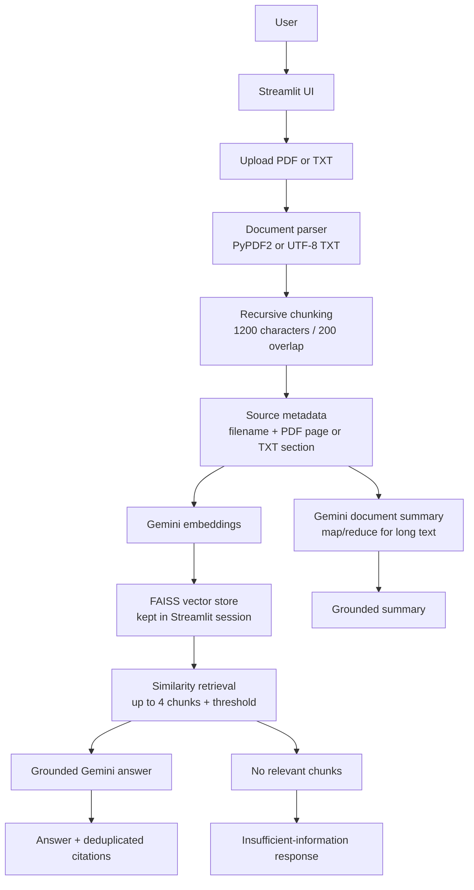

# Smart Document Assistant Architecture

The relevance threshold is a practical safeguard, not a guarantee of factual correctness. The model is also instructed to use only retrieved context and the UI displays only metadata attached to retrieved chunks.
