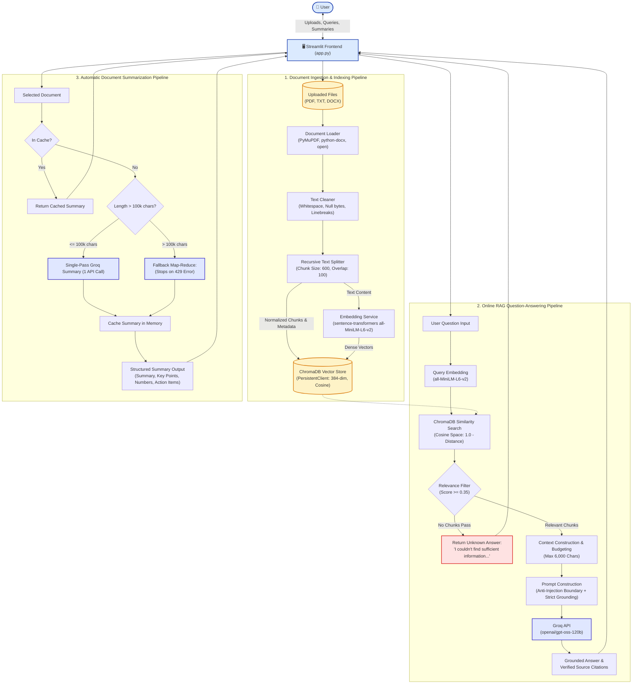

# Smart Document Assistant — System Architecture & Data Flow

This document details the architectural design, component interactions, and data flow of the **Smart Document Assistant**.

---

## 1. High-Level Architecture Overview

The system is organized into three decoupled pipelines:
1. **Document Ingestion & Indexing Pipeline (Offline/Batch)**: Ingests documents (PDF, TXT, DOCX), performs text extraction and cleaning, segments text recursively with metadata preservation, generates normalized dense embeddings, and stores them in a local persistent ChromaDB vector store.
2. **Retrieval-Augmented Generation (RAG) Pipeline (Online)**: Takes user queries, embeds them, performs similarity search in ChromaDB, filters by relevance threshold, bounds context length, wraps context in anti-injection boundaries, and invokes Groq (`openai/gpt-oss-120b`) to produce factual answers with precise source citations.
3. **Automatic Document Summarization Pipeline**: Takes complete document text, provides single-pass structured insights (Summary, Key Points, Important Numbers, Action Items) for small/medium documents in a single API call, and provides fallback section map-reduce with immediate rate-limit abortion for massive documents, complete with SHA-256 caching.

---

## 2. Mermaid Architecture Diagram

```mermaid
flowchart TD
    %% User and Interface
    User(["👤 User"])
    UI["🖥️ Streamlit Frontend (app.py)"]
    User <-->|"Uploads, Queries, Summaries"| UI

    %% Ingestion Pipeline
    subgraph INGESTION["1. Document Ingestion & Indexing Pipeline"]
        Uploads[("Uploaded Files\n(PDF, TXT, DOCX)")]
        Loader["Document Loader\n(PyMuPDF, python-docx, open)"]
        Cleaner["Text Cleaner\n(Whitespace, Null bytes, Linebreaks)"]
        Splitter["Recursive Text Splitter\n(Chunk Size: 600, Overlap: 100)"]
        Embedder["Embedding Service\n(sentence-transformers all-MiniLM-L6-v2)"]
        Chroma[("ChromaDB Vector Store\n(PersistentClient: 384-dim, Cosine)")]

        Uploads --> Loader
        Loader --> Cleaner
        Cleaner --> Splitter
        Splitter -->|"Normalized Chunks & Metadata"| Chroma
        Splitter -->|"Text Content"| Embedder
        Embedder -->|"Dense Vectors"| Chroma
    end

    %% Online RAG Pipeline
    subgraph RAG["2. Online RAG Question-Answering Pipeline"]
        QueryIn["User Question Input"]
        QueryEmbed["Query Embedding\n(all-MiniLM-L6-v2)"]
        SimilaritySearch["ChromaDB Similarity Search\n(Cosine Space: 1.0 - Distance)"]
        ThresholdFilter{"Relevance Filter\n(Score >= 0.35)"}
        UnknownResp["Return Unknown Answer:\n'I couldn't find sufficient information...'"]
        ContextBuilder["Context Construction & Budgeting\n(Max 6,000 Chars)"]
        SafetyBoundary["Prompt Construction\n(Anti-Injection Boundary + Strict Grounding)"]
        GroqLLM["Groq API\n(openai/gpt-oss-120b)"]
        AnswerOutput["Grounded Answer &\nVerified Source Citations"]

        QueryIn --> QueryEmbed
        QueryEmbed --> SimilaritySearch
        Chroma -.-> SimilaritySearch
        SimilaritySearch --> ThresholdFilter
        ThresholdFilter -- "No Chunks Pass" --> UnknownResp
        ThresholdFilter -- "Relevant Chunks" --> ContextBuilder
        ContextBuilder --> SafetyBoundary
        SafetyBoundary --> GroqLLM
        GroqLLM --> AnswerOutput
    end

    %% Summarization Pipeline
    subgraph SUMMARY["3. Automatic Document Summarization Pipeline"]
        SelectDoc["Selected Document"]
        CacheCheck{"In Cache?"}
        CachedSumm["Return Cached Summary"]
        DocLengthCheck{"Length > 100k chars?"}
        SinglePass["Single-Pass Groq Summary (1 API Call)"]
        MapReduce["Fallback Map-Reduce:\n(Stops on 429 Error)"]
        SaveCache["Cache Summary in Memory"]
        FinalSummary["Structured Summary Output\n(Summary, Key Points, Numbers, Action Items)"]

        SelectDoc --> CacheCheck
        CacheCheck -- "Yes" --> CachedSumm
        CacheCheck -- "No" --> DocLengthCheck
        DocLengthCheck -- "<= 100k chars" --> SinglePass
        DocLengthCheck -- "> 100k chars" --> MapReduce
        SinglePass --> SaveCache
        MapReduce --> SaveCache
        SaveCache --> FinalSummary
    end

    %% Connections to UI
    UI --> Uploads
    UI --> QueryIn
    UI --> SelectDoc
    AnswerOutput --> UI
    UnknownResp --> UI
    FinalSummary --> UI
    CachedSumm --> UI

    classDef primary fill:#DBEAFE,stroke:#1E40AF,stroke-width:2px;
    classDef storage fill:#FEF3C7,stroke:#D97706,stroke-width:2px;
    classDef llm fill:#E0E7FF,stroke:#4338CA,stroke-width:2px;
    classDef reject fill:#FEE2E2,stroke:#DC2626,stroke-width:2px;

    class UI,User primary;
    class Chroma,Uploads storage;
    class GroqLLM,SinglePass,MapReduce llm;
    class UnknownResp reject;
```

---

## 3. Component Details & Design Decisions

### 3.1 Document Ingestion & Storage
- **PyMuPDF (`fitz`)**: Fast PDF parser capable of extracting page-level blocks and accurate page numbers. `pypdf` is retained as an automated fallback.
- **python-docx**: Parses paragraphs and structured tables from DOCX documents.
- **Recursive Character Splitting**: Separates text hierarchically (`\n\n` -> `\n` -> `. ` -> ` ` -> `""`), guaranteeing natural boundary cuts (paragraphs, sentences) rather than splitting mid-sentence or mid-word.
- **Metadata Association**: Each chunk carries `source`, `page_number`, `chunk_id`, and `chunk_index`.

### 3.2 Dense Vector Search & ChromaDB
- **Model**: `all-MiniLM-L6-v2` produces 384-dimensional dense vectors. It is fast, lightweight (~80MB), and runs efficiently on local CPU.
- **Metric**: Collection initialized with `{"hnsw:space": "cosine"}`. ChromaDB computes cosine distance ($d \in [0, 2]$), converted to cosine similarity ($1.0 - d$) matching standard inner product thresholding.
- **Persistence**: Managed automatically by `chromadb.PersistentClient` in `data/chroma_db/`, storing both dense vector embeddings and chunk metadata seamlessly in SQLite (`chroma.sqlite3`) and HNSW index files without requiring separate serialization scripts.

### 3.3 Anti-Hallucination & Prompt Injection Safeguards
1. **Relevance Thresholding**: Before passing context to Groq, chunks with cosine similarity $< 0.35$ are excluded. If zero chunks exceed the threshold, the system immediately returns:
   > *"I couldn't find sufficient information to answer this question in the uploaded documents."*
   without wasting API calls or allowing the model to hallucinate.
2. **Context Length Budgeting**: Chunks are truncated at a maximum budget (default: 6,000 characters) to avoid prompt dilation and high latency.
3. **Untrusted Data Boundaries**: Context excerpts are explicitly encapsulated within `<document_context>` XML tags. The system prompt instructs the model to ignore instructions inside excerpts, defending against prompt injection.
4. **Contradiction Resolution**: The system instructs the model to identify conflicting statements across documents and cite both sources rather than arbitrarily selecting one.
5. **No Hallucinated Citations**: Source attribution is constructed deterministically from retrieved `TextChunk` metadata objects, not generated freely by the LLM.
